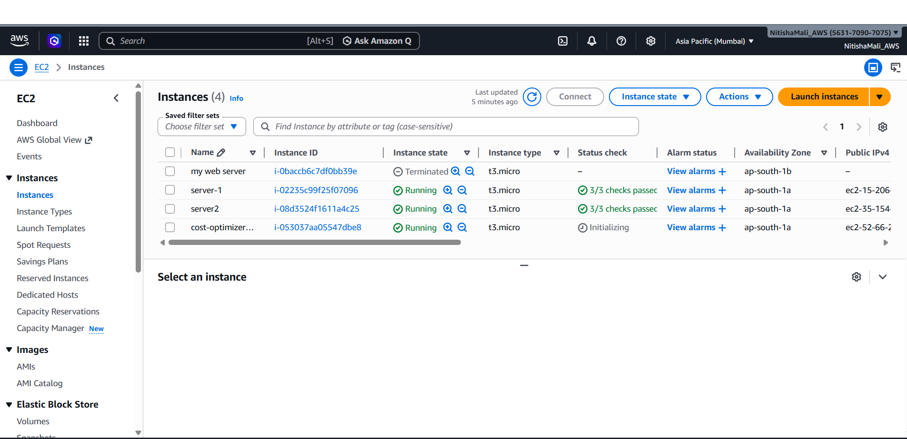
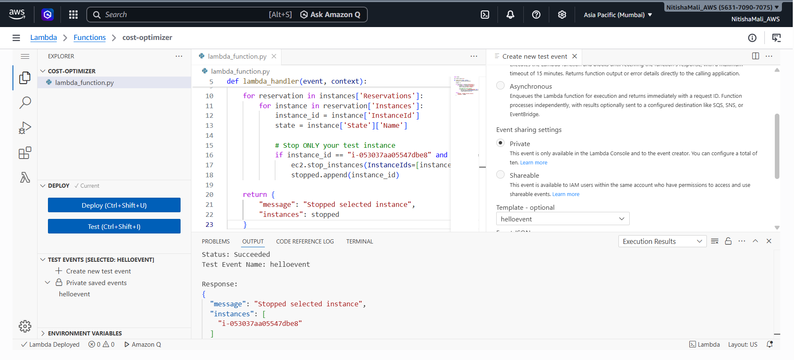
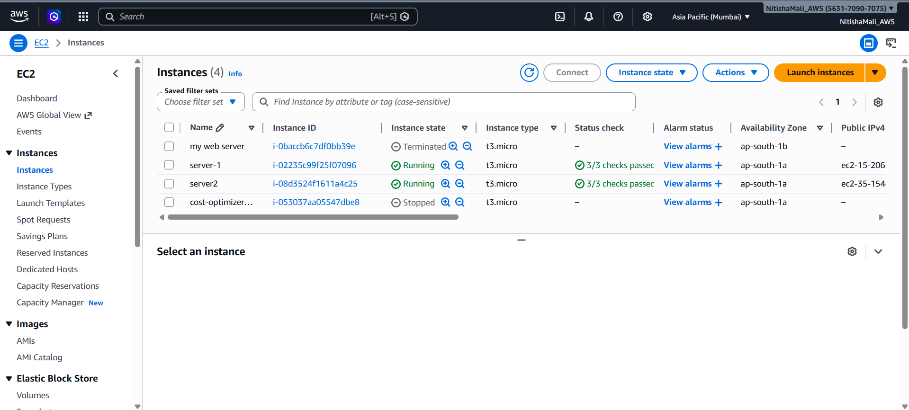
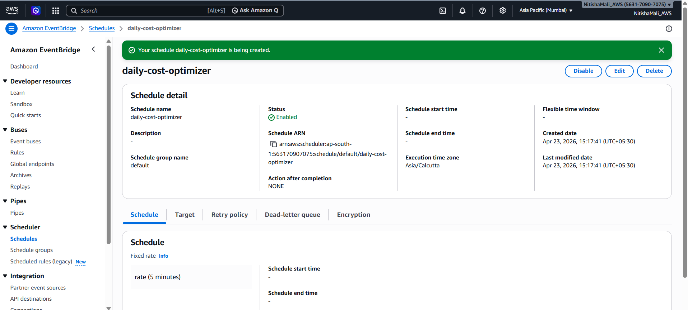

#  AWS Automated Cost Optimizer

## 📌 Overview

This project automatically reduces AWS cloud costs by stopping unused EC2 instances using serverless automation.

It uses AWS Lambda and EventBridge Scheduler to monitor and control EC2 usage without manual intervention.

---

## 🎯 Objective

To minimize unnecessary AWS spending by automatically shutting down idle or selected EC2 instances.

---

## 🧰 Technologies Used

* AWS Lambda
* Amazon EC2
* Amazon EventBridge Scheduler
* Python (Boto3)

---

## ⚙️ How It Works

1. EventBridge Scheduler triggers the Lambda function at a fixed interval
2. Lambda scans running EC2 instances
3. Matches the target instance
4. Stops the instance automatically

---

## 🏗️ Architecture

---

## 📸 Screenshots

### 🖥️ EC2 Instance (Before Automation)

### ⚡ Lambda Function Code

### 🧪 Lambda Execution Result

### 🛑 EC2 Instance (After Automation)

### ⏰ EventBridge Schedule

---

## 🚀 Setup Instructions

1. Launch an EC2 instance
2. Create an IAM role with EC2 permissions
3. Create a Lambda function and add the Python script
4. Deploy and test the Lambda function
5. Configure EventBridge Scheduler to trigger Lambda

---

## 💡 Key Features

* Automated cost optimization
* Serverless architecture
* Scheduled execution
* Safe instance targeting

---

## 🔮 Future Improvements

* CPU utilization-based stopping
* Tag-based filtering for production safety
* Email notifications using SNS
* Multi-instance support

---

## 👩‍💻 Author

Nitisha Mali
